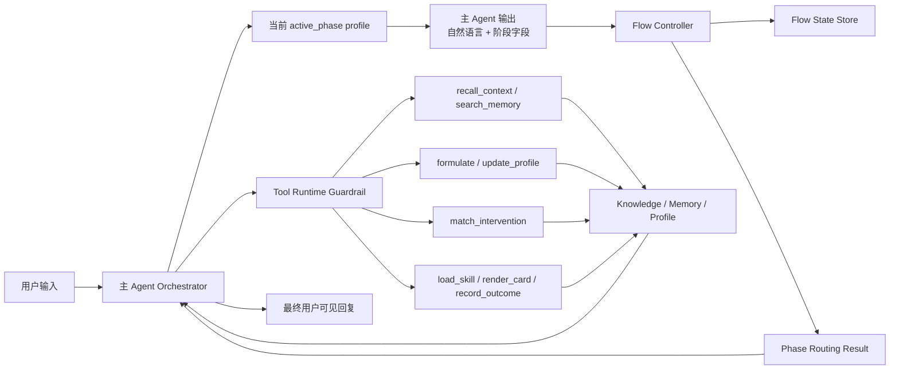
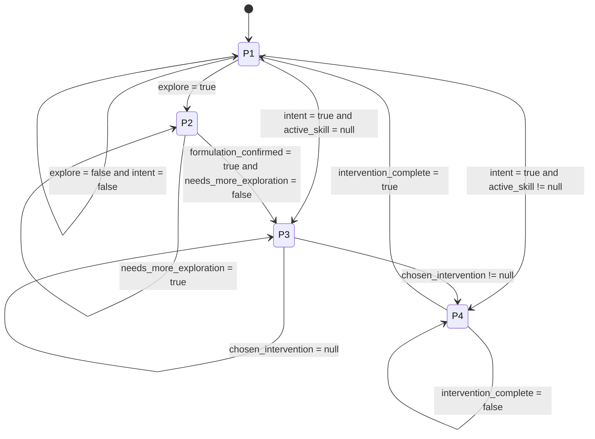

# Flow Controller 与阶段子 Agent 架构 v1

> 本文定义心雀按“主 Agent + 四阶段 phase profile + Flow Controller”实现四阶段咨询流转的长期架构。  
> 本文服从 [`product-plan-v2.1.md`](./product-plan-v2.1.md)，用于把四阶段从“Prompt 内部纪律”收口为“显式阶段流转系统”。

---

## 1. 目标

本文要解决的问题是：

- 用户输入后，系统需要有一个稳定、可解释的阶段入口，而不是只靠模型临场判断
- 四阶段推进需要从“Prompt 里的软性建议”收口为“运行时显式状态迁移”
- 干预执行完成后，需要有明确的结束信号、结果记录和回流入口
- 整个阶段推进过程需要可观测、可测试、可调优

本文的目标不是把心雀改成 5 个彼此独立发言的聊天机器人，而是在保持单一主 Agent 的前提下，让阶段推进具备：

- 可解释
- 可观测
- 可测试
- 可持续演进

---

## 2. 设计定位

### 2.1 单一对外 Agent

对用户而言，始终只有一个“心雀”在说话。

- 只有主 Agent 对外发言
- 四阶段子 Agent 不作为独立会话实体存在
- 子 Agent 只是当前阶段的行为 profile / prompt block / tool 边界

### 2.2 Flow Controller 不是另一个推理 Agent

Flow Controller 不是生成模块，也不是推荐模块，更不是第二个负责“想下一步怎么办”的 LLM。

它应被定义为一个控制平面组件，核心职责是：

- 解析本轮 assistant 输出中的阶段字段与完成信号
- 读取必要的运行时辅助输入
- 做规则驱动的状态迁移
- 产出可执行的下一步控制结果
- 记录规范化后的阶段状态与审计信息

换句话说，Flow Controller 负责把“主 Agent 产出的带阶段标记结果”转成“系统下一步该调用哪个 profile / tool、是否换阶段、要写入什么结构化状态”的运行时决策。

### 2.3 Tool Runtime 只负责守门与执行

Tool runtime 的职责是：

- 校验当前 phase 是否允许该 tool
- 联合 `active_phase`、`active_skill`、安全 guardrail 做 preflight
- 返回结构化 `blocked payload` 或执行结果

Tool runtime 不应取代 Flow Controller 成为主要的阶段推进器。

---

## 3. 与 Limbic 专利的关系

`docs/reference/Limbic/LimbicAI-flow-module-58.md` 提供了一个重要参照：`flow module 58` 的价值不在“又多一个智能体”，而在“输出解析 + 路由控制 + 结构化装配”。

心雀可以借鉴的点：

- Flow 应消费阶段化输出，而不是只看用户原始输入
- Flow 应显式维护多阶段、可回环的状态机
- Flow 不只决定跳转，也要参与形成可供后续模块消费的结构化状态
- Flow 应负责 schema normalization、默认值补全与 trace / 落库

心雀不应机械照搬的点：

- Limbic 是 `52a/52b/52c/52d + prompt generator` 体系；心雀是单一主 Agent + 每轮只注入一个 `active_phase profile`
- Limbic 的 `52b structured information` 更偏“问题标签 + 用户回答”绑定；心雀的结构化理解主体仍应由 `formulate()`、画像与记忆层承接
- Limbic 的直跳干预路径在心雀中必须额外受 `active_phase`、`active_skill`、tool preflight 和安全层约束

因此，心雀应吸收 Limbic 的控制平面思想，但运行时实现仍以 `product-plan-v2.1.md` 的 phase-aware runtime 为准。

---

## 4. 目标架构



这个架构的关键点是：

- 主 Agent 负责生成回复与阶段字段
- Flow Controller 负责解析和迁移，不负责生成自然语言
- 四阶段子 Agent 以 `phase profile` 形式存在，不以独立 LLM 会话存在
- Tool Runtime 是 phase-aware 守门层，不是阶段决策中心

---

## 5. 角色分工

### 5.1 主 Agent Orchestrator

主 Agent 是唯一对外的运行时入口，负责：

- 读取用户输入
- 读取稳定状态与历史上下文
- 选择当前 `active_phase` 对应的 profile
- 组装当轮 prompt
- 调用 Tools
- 生成自然语言回复和阶段字段
- 记录 trace 与状态变更

主 Agent 可以提出阶段意图，但不直接拥有最终阶段迁移权。

### 5.2 Flow Controller

Flow Controller 是四阶段架构中的控制平面。它的职责不是“再推理一遍”，而是：

- 解析 assistant 输出中的阶段字段
- 识别缺失字段并补默认值
- 判断当前阶段是否完成
- 决定下一 `active_phase`
- 输出 `phase_transition_reason`
- 维护最小 `flow_state`
- 把可审计的阶段结果写入 trace / knowledge store

Flow Controller 的直接输入应优先是：

- assistant 本轮阶段化输出
- 当前 `flow_state`
- 当前 `active_skill` 状态
- 相关 tool 返回结果

只有在特定捷径路径下，才辅助读取用户原始输入做 intent disambiguation。

### 5.3 四阶段子 Agent

四个子 Agent 不是四个长期独立会话，而是四个 phase profile。

#### `P1` 共情承接与入口判断

- 目标：承接用户、降低压力、识别是继续倾诉、进入探索，还是明确要求方法
- 重点：不抢跑到推荐和干预
- 典型阶段字段：`intent`、`explore`

#### `P2` 探索与渐进式概念化

- 目标：围绕问题持续追问，逐步形成工作性理解
- 重点：围绕 `Situation / Feeling / Thought / Formulation`
- 典型阶段字段：`asking`、`formulation_confirmed`、`needs_more_exploration`

#### `P3` 推荐与激发

- 目标：基于已形成的理解，解释问题机制，给出有限推荐，并帮助用户选定一个方法
- 重点：不直接跳进 Skill 执行
- 典型阶段字段：`chosen_intervention`

#### `P4` 干预执行与收口

- 目标：执行 Skill、推进步骤、收集反馈、记录结果
- 重点：存在未完成 `active_skill` 时优先继续当前 Skill
- 典型阶段字段：`intervention_complete`

---

## 6. Flow State

Flow State 是跨轮持久化的最小阶段状态，不等于完整 clinical profile，也不等于完整 case formulation。

建议字段如下：

```json
{
  "active_phase": "p1_listener | p2_explorer | p3_recommender | p4_interventor",
  "phase_transition_reason": "string | null",
  "intent": false,
  "explore": false,
  "asking": "situation | feeling | thought | formulation | other | null",
  "formulation_confirmed": false,
  "needs_more_exploration": false,
  "chosen_intervention": null,
  "intervention_complete": false,
  "active_skill": null
}
```

### 字段说明

- `active_phase`
  - 当前主导阶段
- `phase_transition_reason`
  - 为什么切到当前阶段
- `intent`
  - 用户是否明确表达“想直接做方法 / 练习 / 建议”
- `explore`
  - 当前是否应进入或继续 `P2`
- `asking`
  - `P2` 当前优先补哪一类材料
- `formulation_confirmed`
  - 是否已达到进入推荐所需的工作性理解
- `needs_more_exploration`
  - 推荐前是否仍需补信息
- `chosen_intervention`
  - `P3` 是否已经收敛到一个被接受的干预对象
- `intervention_complete`
  - 当前干预是否完成
- `active_skill`
  - 当前执行中的 Skill，会作为 `P4` 优先级守门条件

这里有两个约束：

- `flow_state` 只保存最小阶段控制字段，不复制完整画像或 formulation 内容
- `active_skill` 不是阶段字段的附属品，而是高优先级运行时事实；只要存在未完成 Skill，默认应优先路由到 `P4`

---

## 7. 阶段输出契约

Flow Controller 应优先消费 assistant 的结构化阶段输出，而不是把阶段判断完全外包给后处理规则。

建议每轮主 Agent 输出最小阶段字段对象：

```json
{
  "intent": false,
  "explore": true,
  "asking": "feeling",
  "formulation_confirmed": false,
  "needs_more_exploration": true,
  "chosen_intervention": null,
  "intervention_complete": false
}
```

说明：

- 自然语言回复仍正常输出给用户
- 阶段字段是给 Flow Controller 消费的控制面数据
- 缺失字段由 Flow Controller 补默认值并记 trace
- 若字段与 tool 结果冲突，以运行时事实优先

例如：

- `active_skill` 未完成，但 assistant 给出 `intervention_complete=true`，需要由 runtime 校正
- `chosen_intervention` 为 `null`，则 `P3` 不应推进到 `P4`

---

## 8. Marker 体系

### 8.1 `P1` Marker

`P1` 的目的不是深挖，而是稳定完成入口判断。

核心 marker：

- `intent`
  - 用户明确要方法、练习、建议
- `explore`
  - 当前更适合进入探索而不是继续停留在纯承接

### 8.2 `P2` Marker

`P2` 的核心是围绕四类材料补齐工作性理解。

- `asking`
  - 当前优先补哪一槽位
- `formulation_confirmed`
  - 当前理解是否足以支撑进入推荐
- `needs_more_exploration`
  - 是否还需要继续问而不是转入 `P3`

### 8.3 `P3` Marker

- `chosen_intervention`
  - 是否已收敛并确认一个要进入执行的干预对象

### 8.4 `P4` Marker

- `active_skill`
  - 当前执行中的 Skill
- `intervention_complete`
  - 当前 Skill 是否完成

---

## 9. 阶段流转规则



### 9.1 默认入口

新问题默认从 `P1` 进入。

这里的“默认”不是说每个用户输入都强制重置状态，而是：

- 新主题、新干预闭环结束后的回流、新会话入口，默认应回到 `P1`
- 若已有未完成 `active_skill`，则 `P4` 优先级高于普通入口

### 9.2 `P1 -> P2`

只有当当前更适合继续探索时，才进入 `P2`。典型信号包括：

- 用户已给出足够的事件、情绪、认知线索
- 立即给方法会显得抢跑
- 当前仍需形成工作性理解

### 9.3 `P1 -> P3 / P4`

用户明确要方法时，不代表一定直接执行干预。

推荐规则应是：

- 有现成未完成 `active_skill`：可回到 `P4`
- 无现成 Skill：先进入 `P3` 做有限推荐与协商

也就是说，心雀不应把“想要方法”直接等同于“立刻开始执行 Skill”。

### 9.4 `P2 -> P3`

只有当：

- 当前已达到工作性理解
- `formulation_confirmed = true`
- `needs_more_exploration = false`

才进入 `P3`。

这一步体现的是“探索完成到足以推荐”，不是“材料收集到完美无缺”。

### 9.5 `P3 -> P4`

只有当：

- 已明确一个 `chosen_intervention`
- tool preflight 允许进入执行
- 安全层未阻断

才进入 `P4`。

### 9.6 `P4 -> P1`

当前干预结束后，当前问题闭环结束，应回到新一轮入口。

这一步同时要求：

- 写入 `record_outcome`
- 清理或更新 `active_skill`
- 记录 `phase_transition_reason`

---

## 10. 结构化装配职责

借鉴 Limbic 的 `52b structured information` 思路，心雀的 Flow Controller 不应只做跳转，还应承担最小结构化装配职责。

但装配范围要收紧：

- 负责把 assistant 阶段字段规范化
- 负责把 `asking` 与当轮用户回答建立可追踪关联
- 负责把“阶段推进依据”写入 trace
- 不负责替代 `formulate()` 生成完整个案概念化

因此，心雀里的结构化理解分两层：

- `Flow Controller`
  - 维护阶段字段、标签、完成信号、迁移理由
- `formulate()` / profile / memory
  - 维护更厚的 clinical understanding、画像和长期状态

---

## 11. Tool 与阶段映射

| Phase | 主职责 | 允许的主 Tool |
|---|---|---|
| `P1` | 承接、探查意图、取最小背景 | `recall_context`、`search_memory` |
| `P2` | 探索与概念化 | `formulate`、`search_memory`、`update_profile` |
| `P3` | 推荐与激发 | `match_intervention`、`search_memory` |
| `P4` | 干预执行与收口 | `load_skill`、`render_card`、`record_outcome` |

### 关键约束

- `P1` 不允许无协商直接启动新的 Skill 执行
- `P2` 不允许跳过推荐直接 `load_skill`
- `P3` 只有在 `chosen_intervention` 已确定时才允许进入 `P4`
- `P4` 存在未完成 `active_skill` 时优先继续当前 Skill

---

## 12. Prompt 组织方式

建议 Prompt 分为四层：

1. `base system contract`
   - 人格、安全、长期边界
2. `active phase profile`
   - 当前阶段子 Agent 行为块
3. `working contract`
   - 本轮必须可见的运行时纪律
4. `working context`
   - 语义摘要、稳定状态、检索线索

其中：

- 每轮只注入一个当前 `active_phase profile`
- 不同时注入四套阶段行为块
- 子 Agent 输出的是阶段性行为边界，而不是独立人格
- assistant 必须同时产出“用户可见自然语言”和“Flow 可消费阶段字段”

---

## 13. Trace 与可观测性

至少记录：

- `phase_fields_raw`
- `phase_fields_normalized`
- `phase_routing`
- `phase_transition_reason`
- `phase_profile_selected`
- `tool_blocked_by_phase`
- `active_skill_state_changed`

这可以支持：

- 回溯为什么从 `P1` 进入 `P2`
- 回溯为什么 `P2` 被判定还需继续探索
- 回溯为什么 `P3` 没进 `P4`
- 回溯为什么某个 tool 被阻止

---

## 14. 与当前实现的差异

当前代码已经具备的骨架包括：

- 四阶段 profile
- 最小 phase router
- phase-aware tool guardrail

当前代码尚未完整实现的关键点包括：

- assistant 阶段字段的稳定输出契约
- Flow Controller 对字段的 normalization / 默认值补全
- `asking` 与用户回答的显式关联
- `P2 -> P3` 的 `needs_more_exploration` 判定
- `P3 -> P4` 的 `chosen_intervention` 显式收敛
- `P4 -> P1` 的完整回流与收口记录

因此，当前实现仍是这份架构的前置骨架，而不是最终态。

---

## 15. 实施建议

建议分三轮落地：

### 第一轮

- 固化 assistant 阶段字段 schema
- 引入真正的 `flow_state`
- 明确 `active_skill` 对 `P4` 的优先级

### 第二轮

- 补 Flow Controller 的 normalization / routing / trace
- 补 `P2` 的 `asking`
- 打通 `asking` 与用户回答的可追踪关联

### 第三轮

- 补 `P3 -> P4` 的 `chosen_intervention` 收敛
- 补 `P4 -> P1` 的完成回流
- 完善 eval 与 phase trace

---

## 16. 设计结论

心雀若要按目标图式运行，最合适的方案是：

- **一个主 Agent** 作为唯一对外会话入口
- **四个阶段 phase profile** 作为阶段性行为策略
- **一个 Flow Controller** 作为控制平面与阶段路由核心
- **一个 Tool Runtime** 作为工具守门层

相比“单大 Prompt 自行体会阶段”，这个方案更稳定、可观测、可测试；相比“4 个独立对话 Agent 轮流接管”，它也更符合心雀当前的产品定位与工程约束。
